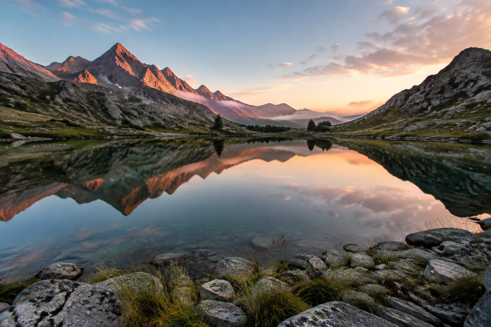

## Le calme avant le jour

La lumière du matin effleure les sommets. Dans le lac immobile, les montagnes et les nuages se
reflètent entre les pierres du premier plan.

_Illustration générée par IA pour cet article de test ; elle ne représente pas un lieu identifié._

## Ouvrir l’image

Cliquez sur le paysage pour l’agrandir. Le bouton d’information affiche ses dimensions et permet
de télécharger le fichier. Au clavier, vous pouvez atteindre l’image avec Tab, l’ouvrir avec
Entrée ou Espace, puis fermer l’aperçu avec Échap.

Cet article de test est accessible par son lien direct et reste absent de l’accueil et de la recherche.
